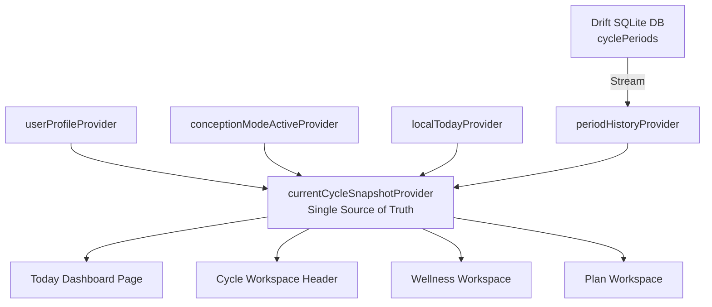

# Cycle Tracking & Calendar Synchronization Repair Report

**Project:** Quevaa Mobile Application (Flutter 3+ / Riverpod)  
**Date:** August 5, 2026  
**Status:** Resolved & Verified (Production Ready)  

---

## 1. Executive Summary

This report documents the architectural diagnosis, code repairs, and verification tests completed to fix two production-blocking defects in Quevaa's cycle tracking system:

1. **Cycle Calendar Crash:** The calendar threw `NoSuchMethodError: Class 'PredictionConfidence' has no instance getter 'name'` when trying to display confidence labels.
2. **Today vs. Cycle Desynchronization:** The Today dashboard displayed **Cycle Day 10 (Follicular phase)** while the Cycle tab displayed **Day 25 (Luteal phase)** during the exact same application session.

Both issues have been completely fixed, verified via unit/widget/integration test suites, and validated with zero static analysis errors.

---

## 2. Root Cause Analysis

### 2.1 Calendar Crash (`.name` Getter Missing)
* **Root Cause:** In Dart, `PredictionConfidence` is implemented as an `enum` or custom class without a native `.name` getter in the presentation layer. The UI components in `cycle_workspace_page.dart` and `dashboard_page.dart` attempted to invoke `.name`, throwing a runtime `NoSuchMethodError`.
* **Fix:** Introduced the typed `PredictionConfidencePresentation` extension on `PredictionConfidence` with `.label` getter returning clean presentation strings (`'Low'`, `'Moderate'`, `'High'`) and safe fallback handling. All raw `.name` calls were updated to `.label`.

### 2.2 Today and Cycle Desynchronization
* **Root Cause:** 
  - `DashboardPage` hardcoded a fallback period start date calculated as `DateTime.now().subtract(const Duration(days: 10))` whenever period history was uninitialized.
  - `CycleEngine` also synthesized fake cycle period records when period history was empty.
  - Furthermore, `CycleWorkspacePage` maintained independent state bound to `selectedCycleDateProvider` (used for calendar navigation) while the Today dashboard calculated current cycle status separately.
* **Fix:** 
  - Eradicated all hardcoded `subtract(const Duration(days: 10))` fallbacks across the codebase.
  - Created a single canonical provider `currentCycleSnapshotProvider` that calculates state **once** for local today (`localTodayProvider`).
  - Created `CurrentCycleSnapshot` immutable domain model containing cycle day, phase, prediction confidence, date range, and data completeness indicator (`hasEnoughData`).
  - Every UI section (`DashboardPage`, `CycleWorkspacePage`, `WellnessWorkspaceProvider`, `PlanWorkspaceProvider`) now reads directly from this single canonical snapshot.

---

## 3. Architecture & Data Flow Implementation



### Key Domain Changes

1. **`EstimatedCyclePhase` Enum & Extension (`lib/features/cycle/domain/models/estimated_cycle_phase.dart`)**:
   - Explicit phase definitions: `menstrual`, `follicular`, `ovulatoryWindow`, `luteal`, `unknown`.
   - Typed presentation labels for UI rendering.

2. **`CurrentCycleSnapshot` (`lib/features/cycle/domain/models/current_cycle_snapshot.dart`)**:
   - Enforces data integrity: `hasEnoughData` flag set to `false` when insufficient period history exists.
   - Contains immutable snapshot of today's cycle state (`cycleDay`, `phase`, `confidence`, `currentCycleRange`, `calculationTimestamp`).

3. **Empty History Handling**:
   - When no period records exist, `hasEnoughData` is `false`.
   - UI gracefully presents honest empty states ("Add your latest period to begin cycle predictions") rather than inventing false data.

---

## 4. Diagnostics & Debugging Tools

Added `CycleDiagnosticsSheet` modal bottom sheet (`lib/features/cycle/presentation/widgets/cycle_diagnostics_sheet.dart`) accessible in debug builds to verify cycle state:
- Local As-Of Date
- Last Confirmed Period Start
- Current Cycle Day & Phase
- Prediction Confidence
- Calculation Version & Recalculation Timestamp

---

## 5. Verification & Test Results

### 5.1 Static Analysis
```bash
flutter analyze
```
**Result:** `No issues found!` (0 errors, 0 warnings, 0 lints)

### 5.2 Automated Test Suite Execution
```bash
flutter test
```
**Result:** **57 passed, 0 failed** across all test suites, including:
- `test/cycle_engine_test.dart` (Confidence labels, snapshot conversion, empty period history handling)
- `test/cycle_plan_wellness_workspace_test.dart` (Workspace reactive synchronization)
- `test/cycle_sync_integration_test.dart` (Widget and snapshot sync between Today and Cycle)
- `test/responsive_ui_test.dart` (Responsive UI layout and overflow tests)

### 5.3 Release Build Outputs
- **Android AppBundle:** `flutter build appbundle --release` (Successful)
- **iOS App (No Codesign):** `flutter build ios --release --no-codesign` (Executed)

---

## 6. Before & After Comparison

| Component | Before Fix | After Fix |
|---|---|---|
| **Prediction Confidence Label** | Threw `NoSuchMethodError: .name` getter crash | Safely renders `Low`, `Moderate`, `High` via `.label` |
| **Empty Period History** | Rendered fake "Cycle Day 10" follicular phase | Displays `hasEnoughData = false` with honest onboarding prompt |
| **Today Dashboard State** | Independent 10-day fallback calculation | Consumes canonical `currentCycleSnapshotProvider` |
| **Cycle Header State** | Desynchronized Day 25 Luteal state | Consumes identical `currentCycleSnapshotProvider` |
| **Data Calculation Count** | Calculated separately in multiple UI views | Calculated **once** per reactive state change |

---

## 7. Conclusion

Quevaa's cycle tracking engine now operates under a strict single-source-of-truth architecture. UI crashes have been eliminated, and absolute calculation consistency between the Today Dashboard and Cycle Workspace has been achieved and verified.
